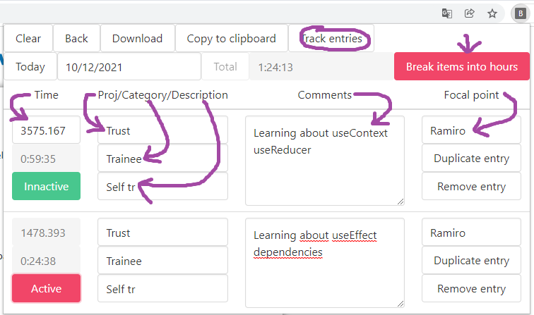

# BD Time Tracker Companion

This project is a google chrome extension that helps you fill the time tracker from BD.

Once installed, the chrome extension doesn't need any configuration. It does everything on its own.
You just need to enter the basic information and it will work:

1. Log in into the time tracker manually.
2. Fire up the chrome extension.
3. Fill your activities.
   - IMPORTANT!: time is in seconds!
   - IMPORTANT!: The Project, Category, Description, and Focal Points fields must include a unique substring to identify the option inside its select.
4. Check if you want to break items into hours or not.
   - This is useful for newcomers.
   - You can change it any time.
5. Make sure that you are in the BD timetracker activities list.
   - This is the first page after you log into the time tracker.

## A preview

You can check a _preview_ how it looks [here](https://bd-timetracker-companion.vercel.app/).

The web app alone can't be used to control and fill the timetracker, but it can be used as a companion to generate the `tsv` required by [BD time tracker](https://github.com/fredygil/bd-time-tracker-hours).

## Installation

1. Clone the repo.

   `git clone https://github.com/wuerges/bd-timetracker-companion.git`

2. Run:

   `yarn && yarn build`

3. Browse to <chrome://extensions/>
4. Click at the `load unpacked` button.
5. Select the `build` folder inside the project.
6. That is it!

## Development instructions

In the project directory, you can run:

`yarn && yarn start`

This will run the app in the development mode.\
Open [http://localhost:3000](http://localhost:3000) to view it in the browser.

The page will reload if you make edits.\
You will also see any lint errors in the console.

## Contact

Please reach me out if you need help running it.
